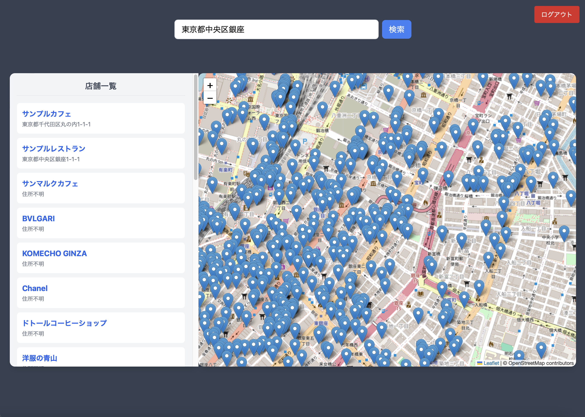
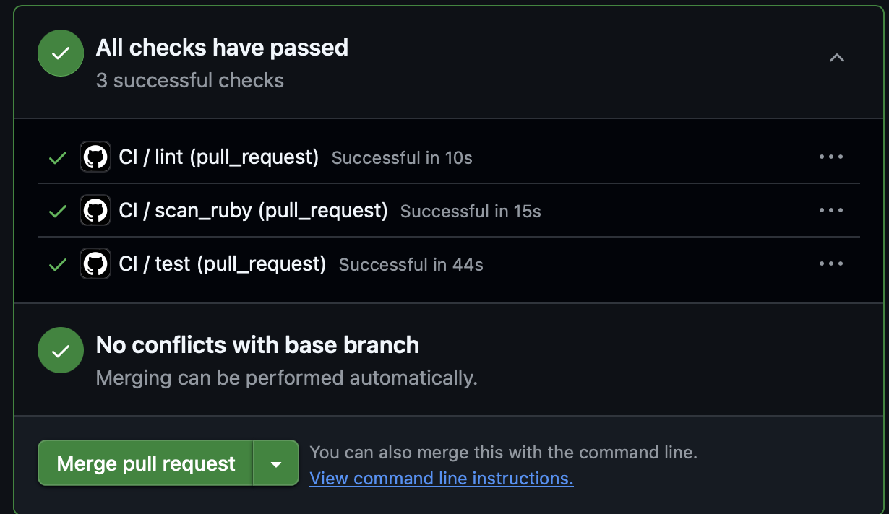

# Map App Backend

> 地域密着型ショップ検索マップアプリ  
> 🌐 公開中: https://map-app-frontend.netlify.app

---

## 🔍 概要

地域のショップ情報を地図上で直感的に検索できるWebアプリです。  
バックエンドに **Ruby on Rails**、フロントエンドに **React + Vite** を採用し、  
APIベースの構成で開発しました。

ユーザーはログイン後、ショップ情報を地図上で確認でき、  
位置情報をもとに直感的に店舗を探すことができます。

---

## 🎨 工夫したポイント

### 1. APIサーバーとフロントエンドの分離

Railsを **APIモード**で構築し、Reactフロントエンドと分離しました。  
これにより

- フロントエンドのUI開発を高速化
- 将来的なモバイルアプリ対応
- スケーラブルな構成

を実現しています。

---

### 2. OAuthログインの導入

ユーザー登録のハードルを下げるため  
**GoogleログインなどのOAuth認証**を実装しました。

- パスワード管理が不要
- UX向上
- セキュアな認証

---

### 3. CI/CDによる自動テスト・デプロイ

GitHub Actionsを利用して

- テスト
- ビルド
- デプロイ

を自動化し、開発効率と品質向上を図っています。

---

### 4. 地図UIによる直感的な店舗検索

Reactの地図ライブラリを使用し

- 店舗位置をマップ上に表示
- 地図操作で店舗を探せる

という **視覚的にわかりやすいUI** を実装しました。

---

## 🛠️ 使用技術

| 種別           | 技術スタック            | 選定理由                                                                    |
| -------------- | ----------------------- | --------------------------------------------------------------------------- |
| フロントエンド | React / Vite            | コンポーネントベースでUIを構築でき、Viteにより高速な開発環境を実現          |
| 地図ライブラリ | Leaflet (React Leaflet) | 軽量で拡張性が高く、Reactと組み合わせてインタラクティブな地図UIを構築できる |
| バックエンド   | Ruby on Rails           | REST APIを高速に開発でき、認証やDB操作などの機能が充実している              |
| インフラ       | Render / Netlify        | 無料枠でもデプロイが容易で、GitHubと連携したCI/CDが簡単                     |
| データベース   | PostgreSQL (Supabase)   | 信頼性が高く、Railsとの相性が良い                                           |
| 認証           | OAuth                   | Googleログインなどを簡単に実装でき、セキュアな認証を提供                    |
| Linter         | RuboCop                 | Rubyコードの品質維持と一貫性の確保                                          |
| E2Eテスト      | Playwright              | マルチブラウザ対応でCI環境でも安定して動作する                              |
| CI/CD          | GitHub Actions          | GitHubと統合しやすく、テスト・デプロイの自動化が可能                        |

---

## 🖥️ UI

### マップ画面

### ログイン画面

### CI/CDパイプラインテスト通過の画像です

## 

## 🚀 今後の改善

- 店舗投稿機能
- レビュー機能
- 検索フィルター機能
- パフォーマンス改善
